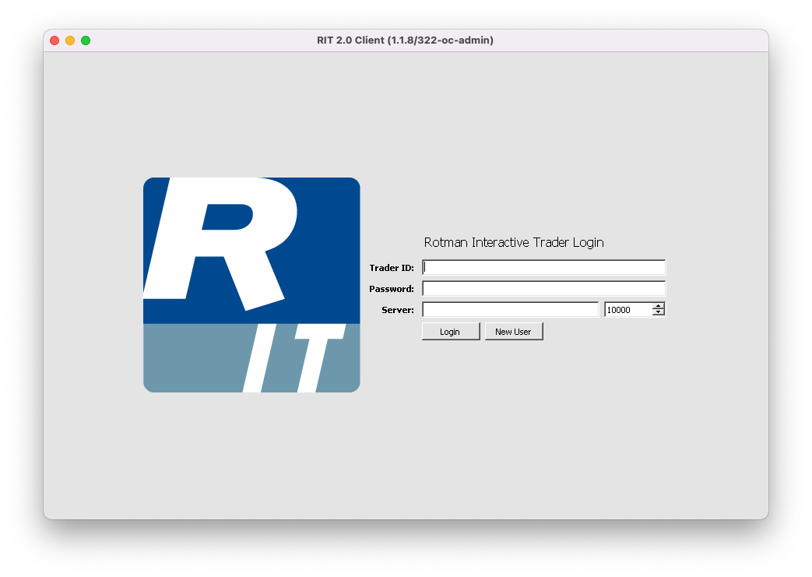

#  Install RIT on macOS

## All steps below will use Mac's  `Terminal.app`

## Install `Wine`

- Step 1: Go to the terminal and install `wine` and `winetricks`:
```sh
brew install --cask --no-quarantine gcenx/wine/wine-crossover
```
```sh
brew install winetricks
```

- Step 2: Initialize wine 
```sh 
wine winecfg
```
A window will pop up. You may consider mapping *Drives* or editing *Desktop Integreations*, but it's not necessary for the use of RIT.

## Install .NET Framework

- Step 3: Install .NET 4.8 using `winetricks`:
```sh
winetricks dotnet48
```
Follow the screen prompts (regular Windows installation process).

## Download RIT

- Step 4: Download RIT to wine's C:\ Drive
```sh
curl 'http://rit.306w.ca/client/Client.application' -o ~/.wine/drive_c/Client.application
```

## Install and run RIT with a single command

- Step 5: Make an alias to the command above:
```sh
echo "alias RIT='wine start C:\Client.application; exit 0'" >> ~/.zshrc
```

- Step 8: Quit  `Terminal.app` by using <kbd>&#8984;</kbd>+<kbd>Q</kbd>.

- Step 9: Reopen `Terminal.app` and you can now run the program by only entering 
```
RIT
```

- Step 11: Follow the installation prompt. When RIT login window appears, it has been successfully installed.



# FAQ

<details>
  <summary>Common Error Messages</summary>
  
  - Q: I got the error message `zsh: bad CPU type in executable`  
     A: Have you installed [Rosetta](./README.md#part-c-install-rosetta-on-m1-macs)?

  - Q: I got the error message `zsh: command not found: brew`  
     A: Have you [added brew to PATH](./README.md#add-homebrew-to-path)? 
     
</details>
