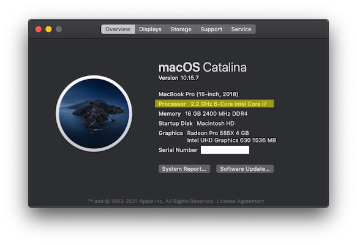
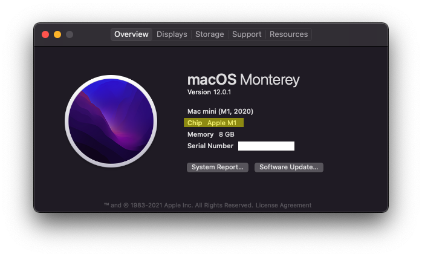
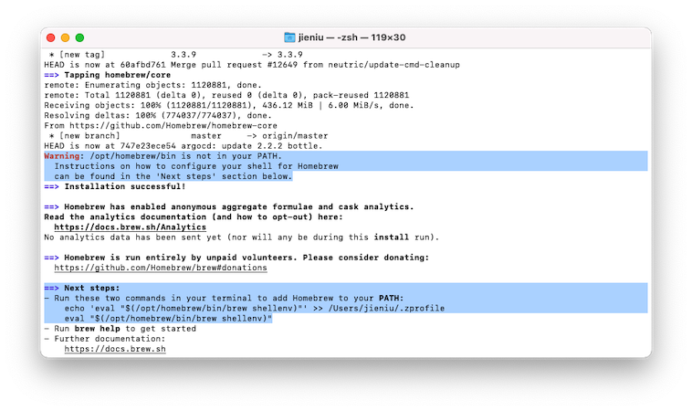

#  Read First

Given one application used in this course is Windows only, some macOS-related tutorials have been created. These tutorials will also be helpful for your future careers.

## PART A: Check your CPU Architecture

New Macs after 2020 come with M1 Chips (Apple's ARM64 Architecture). You can easily check it by clicking on the Apple Logo &#63743; on the upper-left corner, then select **About This Mac**.

| Intel Chip | M1 Chip |
| ----- | ------ |
|  |  |


## Part B: Command-Line Interface on Mac

Part of the course will introduce coding, and basic command-line skills can be helpful. On your keyboard, press <kbd>&#8984;</kbd>+<kbd>SPACE</kbd>, and search for `Terminal.app`.
- By default, you are on the home user directory `~/`
- To run a command, enter the command, then press <kbd>return</kbd> to execute the command
- macOS is a Unix-like system, and you can use most linux commands like `cd`, `ls`, `pwd`, `touch`, `vim`, etc

## Part C: Install Rosetta on M1 Macs

Rosetta 2 makes it possible to run some Intel applications on M1 Macs, including some applications we will use in the course. To install, run the followiing command in the terminal:
```sh
softwareupdate --install-rosetta
```
The terminal will promot you to type <kbd>A</kbd> and press <kbd>return</kbd> to confirm installation.  
Note: The above command will *not* work on Intel Mac, and you don't need Rosetta with Intel Macs.


## Part D: Install Homebrew

[Homebrew](https://brew.sh) is a package management software, similar to Ubuntu's `apt-get`. You will need it to install a few dependencies for softwares used in this course. To install, copy and paste the command below to the terminal:
```sh
/bin/bash -c "$(curl -fsSL https://raw.githubusercontent.com/Homebrew/install/HEAD/install.sh)"
```
Please follow the prompts in the terminal window as it will ask you to enter your computer password and provide confirmations. The process will take around 5 minutes.

#### Add Homebrew to PATH

At the end of the Homebrew installation process, it may ask you to run two commands to add `brew` to your system `$PATH`. Please copy, paste, and run the commands in the terminal.


## Congraduations!

You now have a developer environment on your macOS!
